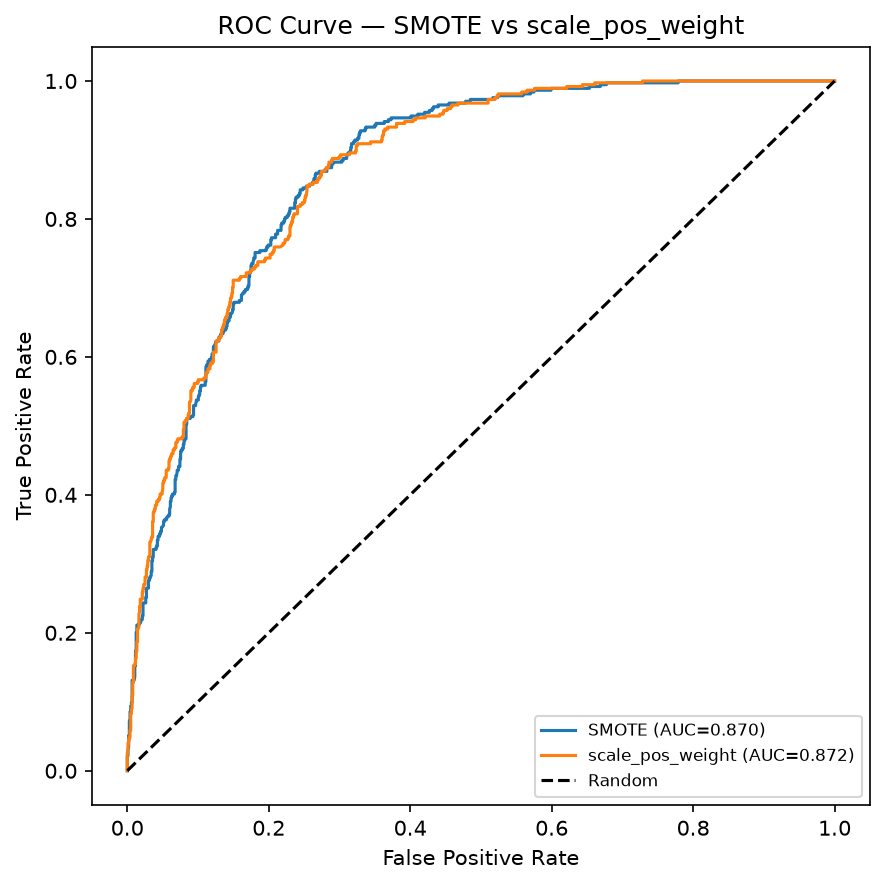
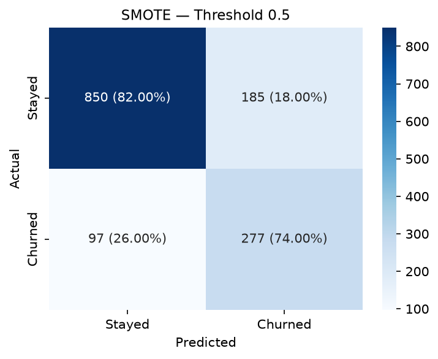
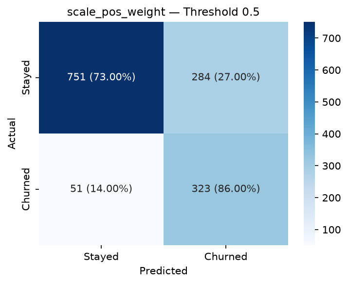
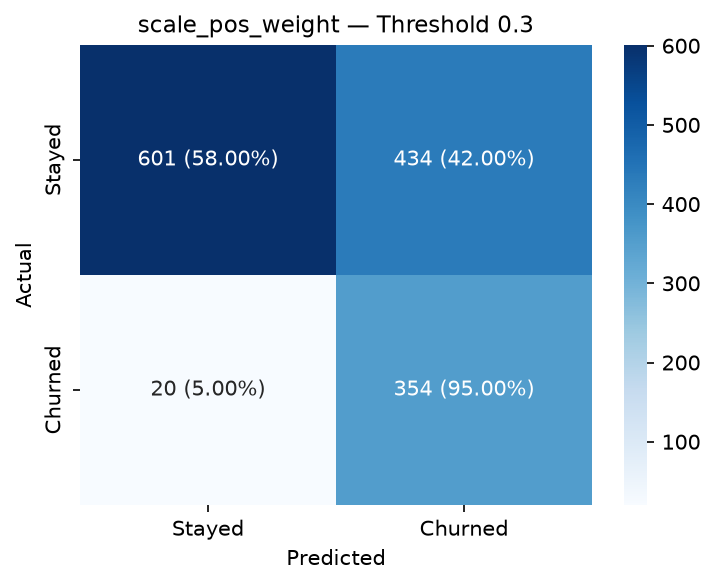
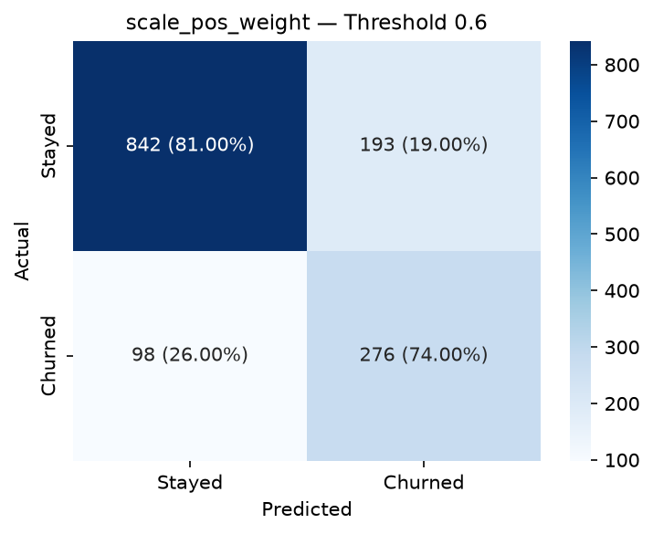

# Customer Churn Prediction & Retention ROI Simulator

An end-to-end ML project that predicts customer churn, explains individual predictions using SHAP, and simulates whether a retention offer is financially worth sending to a specific customer.

**Live Demo:** [Streamlit App Link](https://customer-churn-prediction-jaideep190.streamlit.app/)


---

## Problem Statement

Customer churn directly impacts recurring revenue, and retaining an existing customer is generally cheaper than acquiring a new one. This project goes beyond a churn prediction score to answer three questions:

1. Which customers are likely to churn?
2. Why is a specific customer at risk?
3. Is it financially worth sending that customer a retention offer?

---

## Dataset

[Telco Customer Churn dataset](https://www.kaggle.com/datasets/blastchar/telco-customer-churn) - 7,043 customers, 20 features covering demographics, account details, and subscribed services. Churn rate: ~26.5%.

---

## Modeling Approach

Class imbalance handled using `scale_pos_weight` in XGBoost, tuned against `SMOTE` as a comparison. Final model optimizes for recall over raw accuracy, since missing an actual churner is costlier to the business than a false alarm.

## Results Summary

Two imbalance-handling strategies were evaluated: SMOTE (synthetic oversampling) and `scale_pos_weight` (cost-sensitive learning). The `scale_pos_weight` model was further tested across four thresholds to study the precision/recall trade-off.

| Method | Threshold | ROC AUC | Accuracy | Churn Precision | Churn Recall | Churn F1 |
|---|---|---|---|---|---|---|
| SMOTE | 0.5 | 87.0% | 80.0% | 0.60 | 0.74 | 0.66 |
| scale_pos_weight | 0.3 | 87.2% | 67.8% | 0.45 | 0.95 | 0.61 |
| scale_pos_weight | 0.4 | 87.2% | 72.5% | 0.49 | 0.91 | 0.64 |
| scale_pos_weight | 0.5 | 87.2% | 76.2% | 0.53 | 0.86 | 0.66 |
| scale_pos_weight | 0.6 | 87.2% | 79.4% | 0.59 | 0.74 | 0.65 |

**ROC Curve Comparison**



Both methods reach a nearly identical ROC AUC (~87%), confirming comparable underlying model quality regardless of imbalance-handling technique. The meaningful difference lies in the threshold-dependent precision/recall trade-off shown below.

**Confusion Matrices**

| SMOTE (Threshold 0.5) | scale_pos_weight (Threshold 0.5) |
|---|---|
|  |  |

| scale_pos_weight (Threshold 0.3) | scale_pos_weight (Threshold 0.6) |
|---|---|
|  |  |

---

## Explainability with SHAP

Every prediction is broken down using SHAP `TreeExplainer`, showing exactly which features increased or decreased a specific customer's churn risk - not just a global feature importance chart.


---

## Retention ROI Simulator

Connects the model output to a business decision:

```
Expected Revenue Saved = Churn Probability × Offer Success Rate × Monthly Revenue × Retained Months
Net Value = Expected Revenue Saved − Offer Cost
```

Users can adjust offer cost, success rate, and retention duration to see whether a retention offer is worth sending for a given customer.


---

## How to Run Locally

```bash
git clone https://github.com/jaideep190/Customer-Churn-Prediction
cd churn-prediction-retention-simulator

python -m venv myenv
myenv\Scripts\activate

pip install -r requirements.txt

python src/data_preprocessing.py
python src/train_model.py
python src/evaluate.py
python src/shap_explain.py

streamlit run app/streamlit_app.py
```

---

## Tech Stack

Python, Pandas, NumPy, Scikit-learn, XGBoost, imbalanced-learn, SHAP, Matplotlib, Seaborn, Streamlit

---
