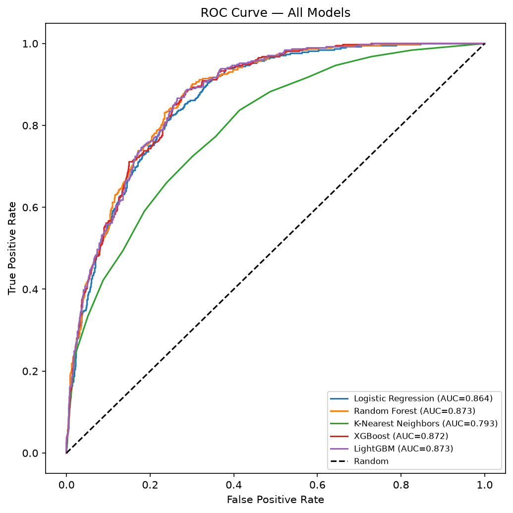

# Customer Churn Prediction & Retention ROI Simulator

An end-to-end ML project that predicts customer churn, explains individual predictions using SHAP, and simulates whether a retention offer is financially worth sending to a specific customer.

**Live Demo:** [Streamlit App Link](https://customer-churn-prediction-jaideep190.streamlit.app/)


---

## Problem Statement

Customer churn directly impacts recurring revenue, and retaining an existing customer is generally cheaper than acquiring a new one. This project goes beyond a churn prediction score to answer three questions:

1. Which customers are likely to churn?
2. Why is a specific customer at risk?
3. Is it financially worth sending that customer a retention offer?

---

## Dataset

[Telco Customer Churn dataset](https://www.kaggle.com/datasets/blastchar/telco-customer-churn) - 7,043 customers, 20 features covering demographics, account details, and subscribed services. Churn rate: ~26.5%.

---

## Modeling Approach

Class imbalance handled using `scale_pos_weight` in XGBoost, tuned against `SMOTE` as a comparison. Final model optimizes for recall over raw accuracy, since missing an actual churner is costlier to the business than a false alarm.

## Results Summary

Five models were trained and compared under identical preprocessing and train/test splits: Logistic Regression, Random Forest, K-Nearest Neighbors, XGBoost, and LightGBM. Class imbalance was handled per-model - `class_weight="balanced"` for Logistic Regression and Random Forest, `scale_pos_weight` for XGBoost and LightGBM, and SMOTE for KNN (which has no native weighting support).

| Model | ROC AUC | Accuracy | Churn Precision | Churn Recall | Churn F1 |
|---|---|---|---|---|---|
| Random Forest | 87.3% | 77.9% | 0.56 | 0.82 | 0.66 |
| LightGBM | 87.3% | 76.3% | 0.53 | 0.87 | 0.66 |
| XGBoost | 87.2% | 76.2% | 0.53 | 0.86 | 0.66 |
| Logistic Regression | 86.4% | 76.0% | 0.53 | 0.84 | 0.65 |
| K-Nearest Neighbors | 79.3% | 70.6% | 0.46 | 0.72 | 0.57 |



**Key finding:** Random Forest, LightGBM, and XGBoost converge to nearly identical performance (ROC AUC within 0.1%, F1 score of 0.66 across all three), suggesting the tree-based ensemble approach itself is well-suited to this dataset, and further gains would likely come from feature engineering rather than model selection. K-Nearest Neighbors underperforms notably, consistent with its known weakness on high-dimensional mixed categorical/numeric feature spaces. Logistic Regression, despite being the simplest model, stays competitive - within 1 point of AUC of the ensemble methods.

**Threshold sensitivity (XGBoost):**

| Threshold | Accuracy | Precision | Recall | F1 |
|---|---|---|---|---|
| 0.3 | 67.8% | 0.45 | 0.95 | 0.61 |
| 0.4 | 72.5% | 0.49 | 0.91 | 0.64 |
| 0.5 | 76.2% | 0.53 | 0.86 | 0.66 |
| 0.6 | 79.4% | 0.59 | 0.74 | 0.65 |

Recall can be pushed as high as 95% by lowering the decision threshold, at the cost of precision. The right threshold depends on the relative cost of a missed churner versus a false alarm - explored directly in the Retention ROI Simulator below, rather than fixed to a single value.

---

## Final Considered Result

**XGBoost** was selected as the production model. While Random Forest, LightGBM, and XGBoost perform near-identically, XGBoost was chosen for consistency with the SHAP explainability analysis and threshold sensitivity testing performed as part of this project. Its performance (87.2% ROC AUC, F1 of 0.66 at the default threshold) is representative of the best achievable result across all tested models on this dataset.

## Explainability with SHAP

Every prediction is broken down using SHAP `TreeExplainer`, showing exactly which features increased or decreased a specific customer's churn risk - not just a global feature importance chart.


---

## Retention ROI Simulator

Connects the model output to a business decision:

```
Expected Revenue Saved = Churn Probability × Offer Success Rate × Monthly Revenue × Retained Months
Net Value = Expected Revenue Saved − Offer Cost
```

Users can adjust offer cost, success rate, and retention duration to see whether a retention offer is worth sending for a given customer.


---

## How to Run Locally

```bash
git clone https://github.com/jaideep190/Customer-Churn-Prediction
cd churn-prediction-retention-simulator

python -m venv myenv
myenv\Scripts\activate

pip install -r requirements.txt

python src/data_preprocessing.py
python src/train_model.py
python src/evaluate.py
python src/shap_explain.py

streamlit run app/streamlit_app.py
```

---

## Tech Stack

Python, Pandas, NumPy, Scikit-learn, XGBoost, imbalanced-learn, SHAP, Matplotlib, Seaborn, Streamlit

---
