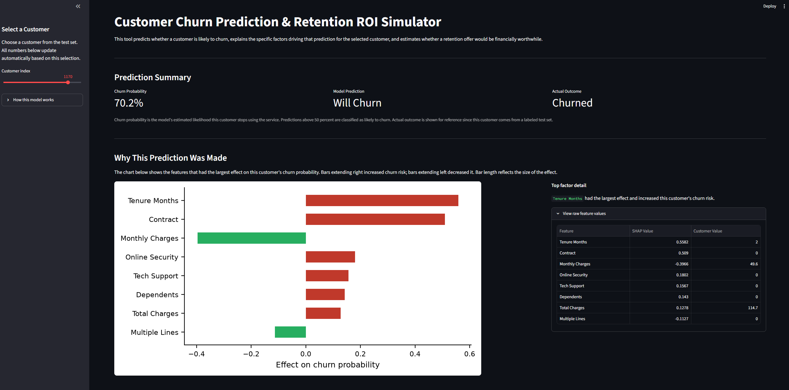
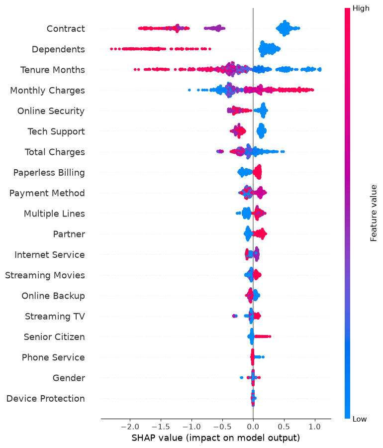
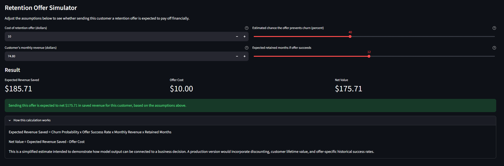

# Customer Churn Prediction & Retention ROI Simulator

An end-to-end ML project that predicts customer churn, explains individual predictions using SHAP, and simulates whether a retention offer is financially worth sending to a specific customer.

**Live Demo:** [Streamlit App Link](https://customer-churn-prediction-jaideep190.streamlit.app/)



---

## Problem Statement

Customer churn directly impacts recurring revenue, and retaining an existing customer is generally cheaper than acquiring a new one. This project goes beyond a churn prediction score to answer three questions:

1. Which customers are likely to churn?
2. Why is a specific customer at risk?
3. Is it financially worth sending that customer a retention offer?

---

## Dataset

[Telco Customer Churn dataset](https://www.kaggle.com/datasets/blastchar/telco-customer-churn) — 7,043 customers, 20 features covering demographics, account details, and subscribed services. Churn rate: ~26.5%.

---

## Key EDA Insights

- Month-to-month contracts churn far more than annual contracts
- ~50% of churned customers leave within the first 10 months
- Fiber optic customers churn more than DSL, likely driven by pricing
- Customers without online security or tech support churn more
- Electronic check payment method has the highest churn rate
- Senior citizens churn at nearly 2x the rate of non-seniors

---

## Modeling Approach

Class imbalance handled using `scale_pos_weight` in XGBoost, tuned against `SMOTE` as a comparison. Final model optimizes for recall over raw accuracy, since missing an actual churner is costlier to the business than a false alarm.

| Metric | Score |
|---|---|
| ROC AUC | 87.3% |
| Accuracy | 76.6% |
| Churn Recall | 0.87 |
| Churn Precision | 0.54 |

### Results Summary

```text
--- Threshold: 0.5 ---
ROC AUC (proba-based):  87.50%
Model accuracy:  81.12%
              precision    recall  f1-score   support

           0       0.88      0.86      0.87      1035
           1       0.64      0.66      0.65       374

    accuracy                           0.81      1409
   macro avg       0.76      0.76      0.76      1409
weighted avg       0.81      0.81      0.81      1409

scale_pos_weight = 2.77

=== Model with scale_pos_weight ===
```

```text
--- Threshold: 0.5 ---
ROC AUC (proba-based):  87.28%
Model accuracy:  76.58%
              precision    recall  f1-score   support

           0       0.94      0.73      0.82      1035
           1       0.54      0.87      0.66       374

    accuracy                           0.77      1409
   macro avg       0.74      0.80      0.74      1409
weighted avg       0.83      0.77      0.78      1409

=== Threshold tuning (using scale_pos_weight model) ===
```

```text
--- Threshold: 0.3 ---
ROC AUC (proba-based):  87.28%
Model accuracy:  68.20%
              precision    recall  f1-score   support

           0       0.97      0.58      0.73      1035
           1       0.45      0.95      0.61       374

    accuracy                           0.68      1409
   macro avg       0.71      0.77      0.67      1409
weighted avg       0.83      0.68      0.70      1409
```

```text
--- Threshold: 0.4 ---
ROC AUC (proba-based):  87.28%
Model accuracy:  72.60%
              precision    recall  f1-score   support

           0       0.95      0.66      0.78      1035
           1       0.49      0.91      0.64       374

    accuracy                           0.73      1409
   macro avg       0.72      0.79      0.71      1409
weighted avg       0.83      0.73      0.74      1409
```

```text
--- Threshold: 0.5 ---
ROC AUC (proba-based):  87.28%
Model accuracy:  76.58%
              precision    recall  f1-score   support

           0       0.94      0.73      0.82      1035
           1       0.54      0.87      0.66       374

    accuracy                           0.77      1409
   macro avg       0.74      0.80      0.74      1409
weighted avg       0.83      0.77      0.78      1409
```

```text
--- Threshold: 0.6 ---
ROC AUC (proba-based):  87.28%
Model accuracy:  79.28%
              precision    recall  f1-score   support

           0       0.89      0.81      0.85      1035
           1       0.59      0.74      0.65       374

    accuracy                           0.79      1409
   macro avg       0.74      0.77      0.75      1409
weighted avg       0.81      0.79      0.80      1409
```
---

## Explainability with SHAP

Every prediction is broken down using SHAP `TreeExplainer`, showing exactly which features increased or decreased a specific customer's churn risk — not just a global feature importance chart.



---

## Retention ROI Simulator

Connects the model output to a business decision:

```
Expected Revenue Saved = Churn Probability × Offer Success Rate × Monthly Revenue × Retained Months
Net Value = Expected Revenue Saved − Offer Cost
```

Users can adjust offer cost, success rate, and retention duration to see whether a retention offer is worth sending for a given customer.



---

## How to Run Locally

```bash
git clone https://github.com/jaideep190/Customer-Churn-Prediction
cd churn-prediction-retention-simulator

python -m venv myenv
myenv\Scripts\activate

pip install -r requirements.txt

python src/data_preprocessing.py
python src/train_model.py
python src/evaluate.py
python src/shap_explain.py

streamlit run app/streamlit_app.py
```

---

## Tech Stack

Python, Pandas, NumPy, Scikit-learn, XGBoost, imbalanced-learn, SHAP, Matplotlib, Seaborn, Streamlit

---
